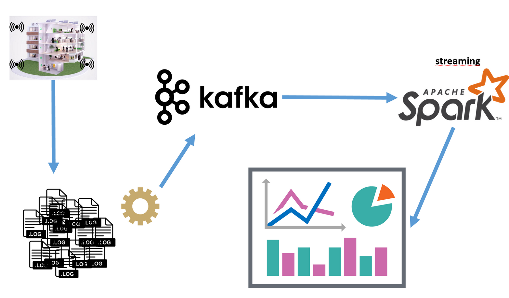
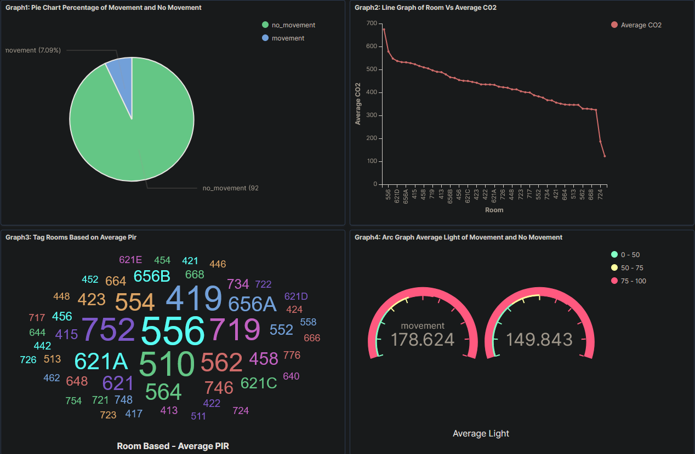
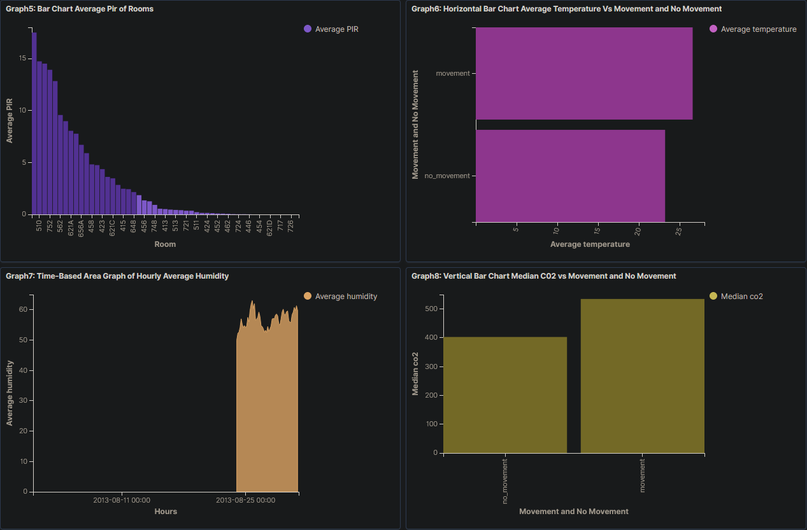

# Sensors Data Realtime Dashboard
- Real-Time Visualization of Sensor Data with Spark Streaming, Kafka, and Kibana


## Dataset : 
- [sensors_instrumented_in_an_office_building_dataset](https://github.com/yemrekarakas/datasets/raw/main/sensors_instrumented_in_an_office_building_dataset.zip)


## Source of Dataset : 
- [smart-building-system](https://www.kaggle.com/ranakrc/smart-building-system)


## About Dataset :
This dataset is collected from 255 sensor time series, instrumented in 51 rooms in 4 floors of the Sutardja Dai Hall(SDH) at UC Berkeley. It can be used to investigate patterns in physical properties of a room in a building. Moreover, it can also be used for experiments relating to Internet-of-Things (IoT), sensor fusion network or time-series tasks. This dataset is suitable for both supervised (classification and regression) and unsupervised learning (clustering) tasks.

Each room includes 5 types of measurements: 
- CO2 concentration, 
- humidity: room air humidity, 
- temperature: room temperature,
- light: luminosity, 
- PIR: PIR motion sensor data

Data was collected over a period of one week from Friday, August 23, 2013 to Saturday, August 31, 2013. The PIR motion sensor is sampled once every 10 seconds and the remaining sensors are sampled once every 5 seconds. Each file contains the timestamps and actual readings from the sensor.

The passive infrared sensor (PIR sensor) is an electronic sensor that measures infrared (IR) light radiating from objects in its field of view, which measures the occupancy in a room. Approximately 6% of the PIR data is non-zero, indicating an occupied status of the room. The remaining 94% of the PIR data is zero, indicating an empty room.


## Tasks :
1. Convert the dataset like below and save it to local disk.
```
            event_ts_min 	ts_min_bignt room 	co2         light 	    temp 	    humidity 	pir
0 	2013-08-24 02:04:00 	1377299040 	656A 	578.500000 	176.500000 	24.370001 	49.900002 	28.500000 
1 	2013-08-24 02:04:00 	1377299040 	746 	633.000000 	29.000000 	23.059999 	52.840000 	21.000000
2 	2013-08-24 02:05:00 	1377299100 	413 	494.727273 	96.555556 	23.927778 	45.330001 	0.000000
3 	2013-08-24 02:05:00 	1377299100 	421 	362.900000 	194.700000 	22.837000 	52.877999 	0.000000
``` 

2. Produce the dataset from the local disk with the data-generator into a Kafka topic named `office-input`

3. Consume `office-input` Kafka topic with Spark Streaming. Create structured data and write it as an index to Elasticsearch.

4. Create visualizations with Kibana and show the changes in graphs (hint: graphics should refresh every few seconds)




## Steps :
1. download data in /app/data/

2. build Dockerfile 
```sh
docker build --pull --rm -f Dockerfile -t yek:spark3.4.1-scala2.12-java11-ubuntu .
```

3. docker compose up
```sh
docker compose -f docker-compose.yml up -d --build
```

4. connect spark container 
```sh
docker exec -it spark bash
```

5. read csvs
```sh
spark-submit \
  --master spark://spark:7077 \
  --executor-memory 4g \
  --driver-memory 4g \
  spark_read_csv.py
```

6. datagen dataframe to kafka
```sh
python3 dataframe_to_kafka.py \
  -b kafka:9093 \
  -t office-input \
  -i /app/output/sensor_data/*.csv -rst 0.1
```

7. [Kibana](http://localhost:5601/app/home)

8. create mapping *sensor_data*
```json
PUT /sensor_data
{
  "settings": {
    "number_of_shards": 1,
    "number_of_replicas": 1
  },
  "mappings": {
    "properties": {
      "event_ts_min": {"type": "date",
        "format": "yyyy-MM-dd HH:mm:ss"
      },
      "ts_min_bignt": {"type": "integer"},
      "room": {
        "type": "text",
        "fields": {
          "keyword": {
            "type": "keyword",
            "ignore_above": 256
          }
        }
      },
      "co2": {"type": "double"},
      "humidity": {"type": "double"},
      "light": {"type": "double"},
      "pir": {"type": "double"},
      "temperature": {"type": "double"},
      "movement_status": {
        "type": "text",
        "fields": {
          "keyword": {
            "type": "keyword",
            "ignore_above": 256
          }
        }
      }
    }
  }
}
```

9. spark streamming (kafka -> elasticsearch)
```bash
spark-submit --packages \
org.apache.spark:spark-sql-kafka-0-10_2.12:3.2.0,\
org.elasticsearch:elasticsearch-spark-30_2.12:7.12.0,\
commons-httpclient:commons-httpclient:3.1 \
spark_streaming.py
```


## Dashboard :

